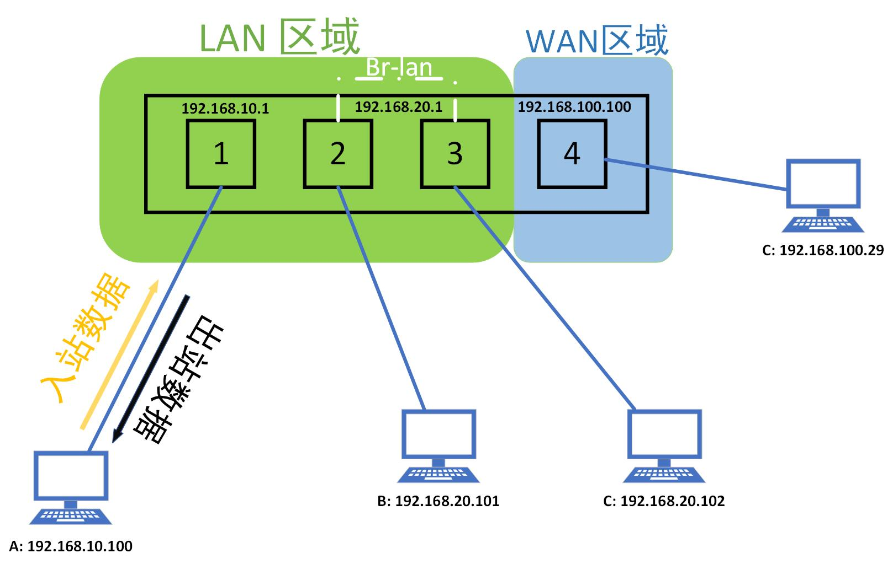
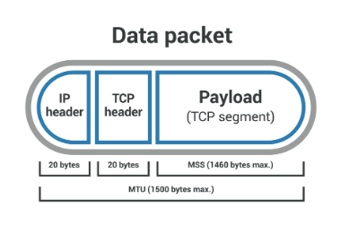

## OpenWRT 小记

### 防火墙 - IP动态伪装 选项
> IP 动态伪装，说白了，就是网络地址转换(NAT)，参考资料：
> [网络地址转换](https://zh.wikipedia.org/wiki/%E7%BD%91%E7%BB%9C%E5%9C%B0%E5%9D%80%E8%BD%AC%E6%8D%A2)

> 选项所在位置：OpenWRT - 网络 - 防火墙，区域为【LAN-WAN，以及 WAN-ACCEPT】，同时开关IP动态伪装这两个选项。

> 实验环境：OpenWRT作为与客户机同网段平级的“旁路网关”（又称旁路由、透明网关）

#### 关闭 IP动态伪装
如果在防火墙中【关闭】了IP动态伪装（NAT），则主网关接收的数据包源IP就是客户机的IP，而不是OpenWRT的IP。此时，主网关在做端口映射时（WAN+port映射为内网IP+port），可以直接将客户机IP+端口设置为映射目标。

#### 开启 IP动态伪装

如果在防火墙中【开启】了IP动态伪装（NAT），那么客户机的网关为OpenWRT，客户机发向OpenWRT的数据包，会被OpenWRT把数据包的源IP（客户机IP）伪装成（NAT转换为）OpenWRT自己的IP，对于主网关而言，数据包就是从OpenWRT发来的，而不是客户机发来的。

如果远程目标响应了数据包，那么数据包的目标应该是OpenWRT的IP，而不是客户机的IP。主网关会把数据包转发给OpenWRT，而不是客户机。所以，这个时候在主网关做端口映射时，就不能使用客户机的IP+端口作为映射目标了，就需要把OpenWRT的IP+端口设置为映射目标，然后再把OpenWRT中【防火墙 - 端口转发】设置主路由的目标端口作为转发的外部端口（对于OpenWRT而言，主网关就是公网），映射到内网IP+最终端口，来实现公网映射。

最终的链路就是（假设需求是公网8000端口映射到客户机9000端口）：主网关(:8000) -> OpenWRT(8000->端口转发到客户机:9000) -> 客户机(:9000) 

### 防火墙设置说明

参考：[资料](https://zt0729.xyz/archives/56/)

- 启用 SYN-flood 防护：拒绝服务攻击的防护（DDOS防护）
- 丢弃无效数据包：字面意思，丢弃无效数据包.
- 启用 FullCone-NAT：这个相当于让局域网内设备都能获得 NAT1 的类型（上层需要时NAT1）(不建议开启)
- 3个出入转发规则：当接口没有加入任何一个防火墙区域的时候，就遵循这个默认规则。（相当于默认区域的防火墙规则。跟下面区域规则是一个意思）.

#### 详解 防火墙区域
假设：
- openwrt 软路由有 4 个网口，分别连接 4 个设备。
- 1、2、3 口处于 LAN 防火墙区域，4 口处于 WAN 防火墙区域。
- 2 与 3 口组成一个 br-lan 网桥端口（桥接），在同一子网下，跟 1 口是不同子网。

入站：对于LAN区域防火墙而言，当设备 A 主动访问网关的时候，叫入站。包括网关回复的应答，这个应答不属于出站规则的管理范畴。

出站：对于LAN区域防火墙而言，当网关主动访问设备 A 的时候，叫出站。包括网A回复的应答。

转发：当 A 设备访问 B 设备的时候，就叫 LAN 区域内的转发。局域网内不同LAN网段之间的访问。

IP 动态伪装：假设 LAN 区域开启了 IP 动态伪装，那么当 A 设备访问 B 设备的时候，本来 B 获取到的信息应该是 A 要访问它，但开启 IP 动态伪装之后，B 会觉得是网关（一般是子网的网关地址）访问了它，而不是A。

> WAN 区域的 IP 动态伪装是需要默认开启的，不能关闭的。想象一下，如果WAN 区域关闭了IP 动态伪装，你现在访问百度网站，对于百度服务器而言，来源IP是什么？

### MTU 和 MSS钳制

资料：[什么是 MSS（最大分段大小）？](https://www.cloudflare.com/zh-cn/learning/network-layer/what-is-mss/)

MTU 是 Maximum Transmission Unit，最大传输单元，是 IP 协议中规定的一个数据包的最大长度。

MSS 是 Maximum Segment Size，最大分段大小，是TCP协议中规定的一个数据包的最大长度。MSS 由另一个与数据包大小有关的指标决定：MTU（最大传输单位），它包括 TCP 和 IP（互联网协议）标头。继续类比，MTU 测量的是卡车及其拖车和货物的总重量，而不仅仅是拖车和货物。

MTU 和 MSS 之间的主要区别之一是，如果数据包超过设备的 MTU，则会分解为更小的部分，或“分段”。相反，如果一个数据包超过 MSS，它就会被丢弃并且不会被传递。

简单来说：

MTU 是网络传输中最大的整个报文包大小（字节为单位）。

MSS 是网络传输中包的载荷量的最大值（字节为单位）。

本质上，MSS 等于 MTU 减去 TCP 标头和 IP 标头的大小：

MTU = MSS + 包的头数据(TCP 标头 + IP 标头)

> 假设一个网络路由器拥有一个 1500 的 MTU，也就是说它只接受最长 1500 字节的数据包（更长的数据包将被分段）。该路由器的 MSS 应该设置为多少？

MSS 1460bytes = MTU 1500bytes - TCP 标头20bytes - IP 标头20bytes

